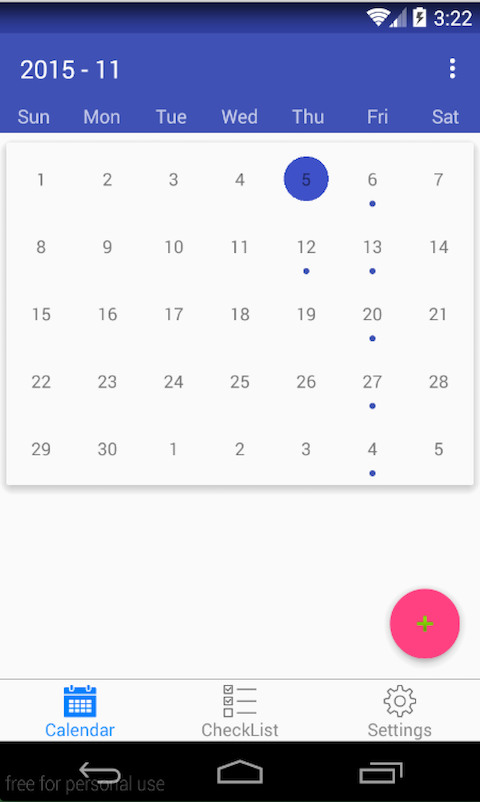
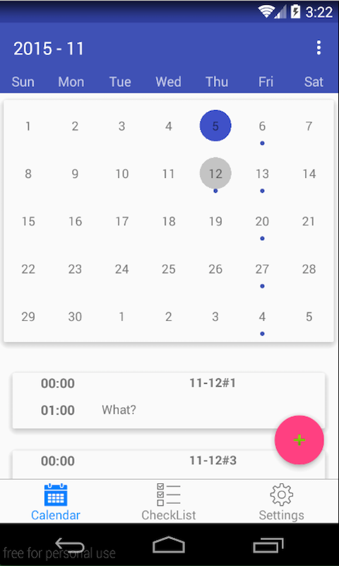
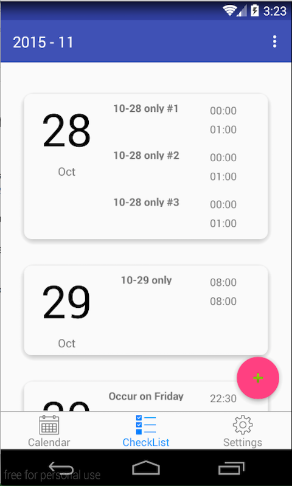
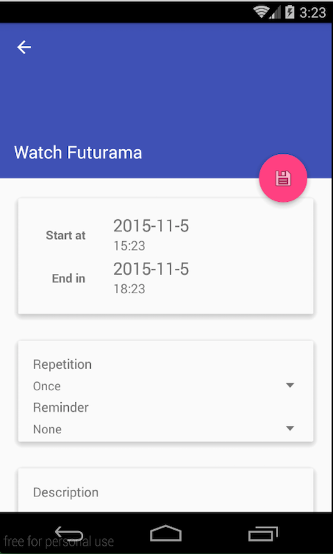

#mCalendar
Material Design Calendar APP for Android

This calendar app is based on my own calendar widget [mCalendarView](https://github.com/SpongeBobSun/mCalendarView)

###Screenshots
    
    

###Project Status
* WIP
* Basic functions are working.

###Open Source Libs Used
* [SystemBarTint](https://github.com/jgilfelt/SystemBarTint) By jgilfelt
* [MaterialDateTimePicker](https://github.com/wdullaer/MaterialDateTimePicker) By wdullaer
* [mCalendarView](https://github.com/SpongeBobSun/mCalendarView) By me
* [TabBar](https://github.com/SpongeBobSun/TabBar) By me

###Todo
* Setting Page
* Context Menu to Delete Tasks
* Select Calendar Account to Save

####Hours Spent on this App
I started this app at 2015-10-26 and today is 2015-11-05.

Only working on this at night.

2 hours spent on this per night.

Catch cold on 10-30 & 11-01, took two days off.

So... maybe 16 hours.